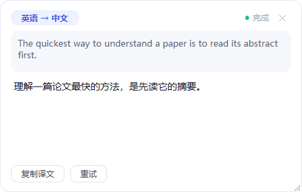

# PopTrans 划词翻译

   

**在任意 Windows 应用里选中文字，鼠标旁弹出「译」按钮，点击即在卡片中流式显示大模型翻译。** 支持 OCR 取词、PDF 公式还原、全局热键，接入任意 OpenAI 兼容接口（智谱 GLM、DeepSeek、Kimi、通义、OpenAI、本地 Ollama 等）。

```
选中文字 ──> 光标旁弹出「译」按钮 ──> 点击 ──> 翻译卡片流式输出
    │                                        │
    └── 或按 Ctrl+Alt+Y 直接翻译 ─────────────┘
```



## 为什么做 PopTrans

看外文文档时最烦的两件事：为了查一个词在窗口间切来切去；从 PDF 复制出来的公式变成乱码。PopTrans 把它们都压缩成「选中 → 出结果」：

- **不用换窗口**：划词后在光标旁就地弹出小按钮，点击即译；也可 `Ctrl+Alt+Y` 一键直翻
- **PDF 公式乱码有救**：大模型按数学语义还原丢失的上下标，并渲染成和论文一致的公式（见下方特色功能）
- **不可复制的文字也能翻**：`Ctrl+Alt+O` 框选屏幕任意区域，OCR 识别后翻译
- **不打断心流**：流式输出、可同时开多张卡片；终端等特殊应用默认不误触

## 核心亮点

### 📐 PDF 公式还原（特色功能）

从 PDF 复制公式时，二维排版会被压平成一串乱码。论文里的

```
aᵢ = σ(s_g[sg(Hᵢ⁽ᵍ⁾) − τ_g])
```

复制出来往往变成 `ai = σ (sg [sg(Hg i ) − τg])`。PopTrans 会让大模型先按数学语义恢复上下标结构，译文中的公式以 LaTeX 书写，并在卡片里渲染回与论文一致的视觉形式。恢复依赖模型推理，极复杂的公式建议人工复核。

### 🖱️ 划词即译

拖选或双击文字 → 光标旁弹出圆形「译」按钮 → 点击即流式显示译文。按钮不抢焦点、不打断输入；内置误触保护：1.5s 防抖、仅拖选/双击触发、终端类应用默认拉黑。

### ⌨️ 热键直翻与 OCR 取词

- `Ctrl+Alt+Y`（可改）：跳过按钮，直接翻译当前选中文字
- `Ctrl+Alt+O`（可改）：屏幕变暗 → 框选文字区域 → 自动识别并翻译。适用于图片文字、扫描版 PDF、视频字幕、无法复制的界面文本；OCR 完全离线（内置 RapidOCR 模型，未安装时回退 Windows 自带 OCR）

### 🃏 体验细节

- 流式输出，边生成边显示；最多同时 6 张卡片，各自拖动、缩放、关闭（✕ 或 Esc）、复制译文、重新翻译
- 5 套卡片主题（浅色/深色/米色/护眼绿/高对比）、译文字号可调，切换后新旧卡片和公式颜色同步生效
- 自动语言检测（中/日/韩/俄/阿/英），默认中英互译，也可固定目标语言
- 取词用的模拟复制会在约 0.6s 后自动恢复你原来的剪贴板内容
- 开机自启（用户级，无需管理员）、托盘常驻、检查更新（自托管 JSON 清单即可，无内置服务端）

## 快速开始

**方式一：下载 exe（推荐）**

到 [Releases](../../releases) 下载 `PopTrans.exe`（单文件、免安装，Windows 10+）。首次运行如遇 SmartScreen 提示「Windows 已保护你的电脑」，点「更多信息 → 仍要运行」（exe 未做代码签名）。

**方式二：源码运行**

需要 Python 3.10+（Windows）：

```bat
pip install -r requirements.txt
python main.py
```

首次启动会自动弹出设置界面：选择服务商预设 → 粘贴 API 密钥 → 点「测试连接」确认可用 → 保存。之后在任意应用里选中文字即可使用。

## 服务商配置

| 服务商 | API 地址 | 模型 | 密钥获取 |
|---|---|---|---|
| 智谱 GLM | `https://open.bigmodel.cn/api/paas/v4` | `glm-4-flash`（免费） | [bigmodel.cn](https://open.bigmodel.cn) |
| DeepSeek | `https://api.deepseek.com/v1` | `deepseek-chat` | [platform.deepseek.com](https://platform.deepseek.com) |
| OpenAI | `https://api.openai.com/v1` | `gpt-4o-mini` | [platform.openai.com](https://platform.openai.com) |
| Kimi | `https://api.moonshot.cn/v1` | `moonshot-v1-8k` | [platform.moonshot.cn](https://platform.moonshot.cn) |
| 通义千问 | `https://dashscope.aliyuncs.com/compatible-mode/v1` | `qwen-turbo` | [阿里云百炼](https://bailian.console.aliyun.com) |

任何 OpenAI 兼容接口（包括本地 Ollama：`http://127.0.0.1:11434/v1`）只需 Base URL + API Key + 模型名三项即可接入。

## 日常操作

| 操作 | 方式 |
|---|---|
| 划词翻译 | 选中文字 → 点弹出的「译」按钮 |
| 热键直翻 | 选中文字 → `Ctrl+Alt+Y` |
| OCR 取词 | `Ctrl+Alt+O` → 框选文字区域（`Esc` 取消） |
| 移动 / 缩放卡片 | 按住卡片顶部拖动；拖右下角手柄缩放 |
| 复制 / 重试 / 关闭 | 卡片底部按钮；`✕` 或 `Esc` 关闭 |
| 托盘菜单 | 开关划词、OCR 取词、设置、检查更新、退出 |

## 设置项

设置界面覆盖：服务商预设 / API 地址 / 密钥 / 模型（可在线拉取模型列表）、翻译方向（自动互译或固定目标语言）、划词开关与热键、应用黑名单、OCR 开关与热键、卡片主题与译文字号、开机自启、自动复制译文、更新地址。

配置文件位于 `%APPDATA%\PopTrans\config.json`。

## 常见问题

**按下热键没反应？**
组合键可能已被其他软件占用——注册失败会静默失效，在设置里换一个组合即可。

**为什么在终端里划词没反应？**
取词靠模拟 `Ctrl+C`，会打断终端操作，因此 cmd / PowerShell / Windows Terminal 等默认在黑名单里，可在设置中自行增删。

**取词会弄丢我的剪贴板吗？**
不会。取词瞬间会短暂切换剪贴板内容，约 0.6s 后自动恢复。唯一例外：如果你在这 0.6s 内恰好复制了新内容，会被恢复动作覆盖。

**有些应用里划不到词？**
少数使用自定义渲染的软件不支持通过 `Ctrl+C` 获取选区，这类应用可以改用 OCR 取词（`Ctrl+Alt+O`）。

**OCR 需要联网吗？**
默认的 RapidOCR 完全离线（内置 PaddleOCR 模型 + ONNX Runtime，启动时后台预热，典型小区域识别约 1-2 秒）。未安装该依赖时自动回退 Windows 自带 OCR，此时需系统已安装对应语言的「文本识别」功能。识别结果会交给大模型翻译，少量字符误差通常不影响译文。

**单次翻译有长度限制吗？**
单次划词即单次请求，不维护跨卡片的会话上下文，选中文本上限 5000 字符。

**支持 macOS / Linux 吗？**
不支持。取词、全局热键、OCR 都使用了 Windows 专属 API，目前仅支持 Windows 10+。

## 开发

```bat
:: 调试启动（输出调试日志）
set POPTRANS_DEBUG=1 && python main.py

:: 本地 mock 大模型（无需真实 key 做端到端调试）http://127.0.0.1:8765/v1
python tools/mock_llm.py

:: 端到端交互辅助（注入双击选词等）
python tools/e2e_click.py word

:: UI 组件离线自测（渲染 + 交互断言）
python tools/ui_selftest.py

:: 重新生成图标
python tools/gen_icon.py

:: 打包单文件 exe（产物 dist\PopTrans.exe）
build.bat
```

**发布新版本**：修改 `app/config.py` 的 `APP_VERSION` → `build.bat` 打包 → 将 `dist/PopTrans.exe` 与 `version.json` 上传到任意静态托管（清单格式 `{"version": "1.1.0", "url": "https://.../PopTrans.exe", "notes": "更新说明"}`）→ 配置了更新地址的用户启动时会自动收到新版本提示。

### 项目结构

```
main.py                  # 入口：装配、单实例（命名互斥体）、事件接线
app/
  config.py              # 配置（JSON 持久化 + 服务商预设）
  detector.py            # 语言检测（Unicode 启发式）+ 方向规则
  translator.py          # OpenAI 兼容流式客户端（QThread + 信号）
  listener.py            # 全局鼠标监听 + 模拟 Ctrl+C 取词
  hotkey.py              # Win32 RegisterHotKey 全局热键
  ocr.py                 # OCR：Qt 截图 + RapidOCR（回退 Windows.Media.Ocr，后台线程）
  formula.py             # LaTeX 公式渲染为 PNG（matplotlib mathtext）
  updater.py             # 启动时后台检查更新
  autostart.py           # 开机自启（HKCU Run 注册表项）
  resources.py           # 图标资源加载
  ui/
    mini_button.py       # 划词迷你按钮（圆形、不抢焦点）
    card.py              # 翻译卡片（圆角、流式渲染、可拖动）
    ocr_selector.py      # OCR 框选遮罩（全屏蒙层 + 橡皮筋选区）
    settings_dialog.py   # 设置界面
    tray.py              # 托盘图标与菜单
tools/
  mock_llm.py            # 本地 mock LLM（SSE 流式）
  e2e_click.py           # 端到端测试辅助（注入鼠标/键盘事件）
  ui_selftest.py         # UI 组件离线渲染与交互自测
  gen_icon.py            # 图标生成脚本
```

### 实现备忘

- **取词原理**：模拟 `Ctrl+C` 读取剪贴板，约 0.6s 内自动恢复原剪贴板，这是 Windows 上兼容性最好的方案；代价是取词瞬间会短暂切换剪贴板内容。
- **弹窗不抢焦点**：迷你按钮用 `WA_ShowWithoutActivating` + `Tool` 窗口实现；圆角通过 `WA_TranslucentBackground` + 样式表实现（顶层窗口不能用 `QGraphicsDropShadowEffect`，会原生崩溃）。
- **热键**：用 Win32 `RegisterHotKey` 注册，不受中文输入法影响（pynput 的字符匹配方案在 IME 下会失效）。
- **OCR 线程**：WinRT 异步调用必须在普通后台线程执行——Qt 主线程的 STA COM 会让 `BitmapDecoder.create_async` 死锁，故截图在主线程完成后交给工作线程识别（带 20s 超时）。
- **多显示器**：OCR 框选遮罩覆盖所有屏幕；截图统一用主屏对象按虚拟桌面全局坐标抓取（Windows 下主屏对象走虚拟桌面 DC，副屏区域同样有效；改用副屏对象传全局坐标会偏移加倍、抓出纯黑图）。

## License

[MIT](LICENSE)
