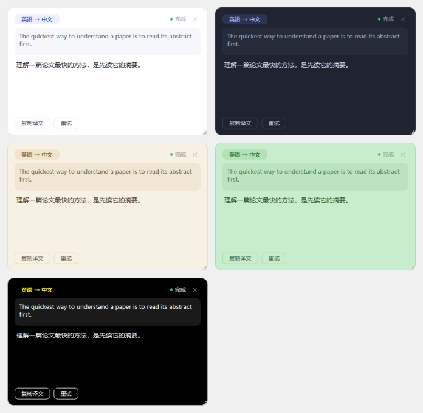

<div align="center">


# PickTrans 划词翻译

> 🌈 在任意 Windows 应用里选中文字，鼠标旁弹出「译」按钮，点击即流式显示大模型翻译

[](https://github.com/ranyh0524/PickTrans/releases)
[](https://github.com/ranyh0524/PickTrans/stargazers)
[](LICENSE)


**[下载安装](#-下载安装) · [使用方式](#-使用方式) · [常见问题](#-常见问题) · [参与开发](#-开发)**

</div>

## 📑 目录

- [📸 使用方式](#-使用方式)
- [✨ 特性](#-特性)
- [📐 PDF 公式还原](#-pdf-公式还原)
- [📦 下载安装](#-下载安装)
- [🤖 支持的服务商](#-支持的服务商)
- [⚙️ 设置](#️-设置)
- [❓ 常见问题](#-常见问题)
- [🛠️ 开发](#️-开发)
- [🙏 致谢](#-致谢)

## 📸 使用方式

<table>
  <tr>
    <td width="33%" align="center"><b>划词翻译</b></td>
    <td width="33%" align="center"><b>热键直翻</b></td>
    <td width="33%" align="center"><b>OCR 取词</b></td>
  </tr>
  <tr>
    <td align="center"></td>
    <td align="center"></td>
    <td align="center"></td>
  </tr>
  <tr>
    <td>选中文字，光标旁弹出「译」按钮，点击即译</td>
    <td><code>Ctrl+Alt+Y</code> 跳过按钮直接翻译当前选中文字</td>
    <td><code>Ctrl+Alt+O</code> 框选屏幕任意区域，离线 OCR 识别后翻译（Esc 取消）</td>
  </tr>
</table>

翻译卡片支持：拖动、缩放、复制译文、重试、✕ / Esc 关闭；最多同时 6 张互不干扰。

## ✨ 特性

- [x] **划词即译** —— 拖选或双击触发，迷你按钮不抢焦点、不打断输入；1.5s 防抖 + 进程黑名单防误触
- [x] **流式输出** —— 边生成边显示，无需等待完整响应
- [x] **PDF 公式还原** —— 自动恢复丢失的上下标，渲染成与论文一致的公式（见下）
- [x] **OCR 取词** —— 内置 RapidOCR 完全离线，图片里、扫描版 PDF、视频字幕里的文字都能翻
- [x] **自动语言方向** —— 中/日/韩/俄/阿/英本地检测，默认中英互译，也可固定目标语言
- [x] **5 套卡片主题** —— 浅色 / 深色 / 米色 / 护眼绿 / 高对比，译文字号可调
- [x] **剪贴板保护** —— 取词用的模拟复制约 0.6s 后自动恢复原内容
- [x] **应用黑名单** —— 终端类应用默认不触发（模拟 Ctrl+C 会打断终端），可自行增删
- [x] **开机自启** —— 写入当前用户启动项，无需管理员权限
- [x] **检查更新** —— 自托管 JSON 清单即可，无内置服务端、无遥测



## 📐 PDF 公式还原

从 PDF 复制公式时，二维排版会被压平成一串乱码。论文里的

```
aᵢ = σ(s_g[sg(Hᵢ⁽ᵍ⁾) − τ_g])
```

复制出来往往变成 `ai = σ (sg [sg(Hg i ) − τg])`。PickTrans 会让大模型先按数学语义恢复上下标结构，译文中的公式以 LaTeX 书写，并在卡片里渲染回与论文一致的视觉形式。恢复依赖模型推理，极复杂的公式建议人工复核。

## 📦 下载安装

**方式一：下载 exe（推荐）**

到 [Releases](https://github.com/ranyh0524/PickTrans/releases) 下载 `PickTrans.exe`（单文件、免安装，Windows 10+）。

**方式二：源码运行**

需要 Python 3.10+（Windows）：

```bat
pip install -r requirements.txt
python main.py
```

首次启动会自动弹出设置界面：选择服务商预设 → 粘贴 API 密钥 → 点「测试连接」确认可用 → 保存。之后在任意应用里选中文字即可使用。

### 🩺 故障排除

<details>
<summary><b>首次运行提示「Windows 已保护你的电脑」</b></summary>

exe 未做代码签名，SmartScreen 会拦截未签名程序。点「更多信息」→「仍要运行」即可。
</details>

<details>
<summary><b>按下热键没反应</b></summary>

组合键可能已被其他软件占用——注册失败会静默失效，在设置里换一个组合即可。
</details>

<details>
<summary><b>在终端里划词没反应</b></summary>

取词靠模拟 <code>Ctrl+C</code>，会打断终端操作，因此 cmd / PowerShell / Windows Terminal 等默认在黑名单里，可在设置中自行增删。
</details>

<details>
<summary><b>取词会弄丢我的剪贴板吗</b></summary>

不会。取词瞬间会短暂切换剪贴板内容，约 0.6s 后自动恢复。唯一例外：如果你在这 0.6s 内恰好复制了新内容，会被恢复动作覆盖。
</details>

<details>
<summary><b>有些应用里划不到词</b></summary>

少数使用自定义渲染的软件不支持通过 <code>Ctrl+C</code> 获取选区，这类应用可以改用 OCR 取词（<code>Ctrl+Alt+O</code>）。
</details>

<details>
<summary><b>OCR 提示需要语言包 / 识别很慢</b></summary>

默认 RapidOCR 完全离线（启动时后台预热，典型小区域识别约 1-2 秒，速度受 CPU 与框选区域大小影响）。未安装该依赖时回退 Windows 自带 OCR，需系统已安装对应语言的「文本识别」功能。识别结果会交给大模型翻译，少量字符误差通常不影响译文。
</details>

<details>
<summary><b>单次翻译有长度限制吗</b></summary>

单次划词即单次请求，不维护跨卡片的会话上下文，选中文本上限 5000 字符。
</details>

## 🤖 支持的服务商

任何 OpenAI 兼容接口只需 **Base URL + API Key + 模型名** 三项即可接入。

| 服务商 | API 地址 | 模型 | 密钥获取 |
|---|---|---|---|
| 智谱 GLM | `https://open.bigmodel.cn/api/paas/v4` | `glm-4-flash`（免费） | [bigmodel.cn](https://open.bigmodel.cn) |
| DeepSeek | `https://api.deepseek.com/v1` | `deepseek-chat` | [platform.deepseek.com](https://platform.deepseek.com) |
| OpenAI | `https://api.openai.com/v1` | `gpt-4o-mini` | [platform.openai.com](https://platform.openai.com) |
| Kimi | `https://api.moonshot.cn/v1` | `moonshot-v1-8k` | [platform.moonshot.cn](https://platform.moonshot.cn) |
| 通义千问 | `https://dashscope.aliyuncs.com/compatible-mode/v1` | `qwen-turbo` | [阿里云百炼](https://bailian.console.aliyun.com) |

本地 Ollama 填 `http://127.0.0.1:11434/v1` 即可。

## ⚙️ 设置

设置界面覆盖：服务商预设 / API 地址 / 密钥 / 模型（可在线拉取模型列表）、翻译方向（自动互译或固定目标语言）、划词开关与热键、应用黑名单、OCR 开关与热键、卡片主题与译文字号、开机自启、自动复制译文、更新地址。

配置文件位于 `%APPDATA%\PickTrans\config.json`。

## 🛠️ 开发

欢迎提 [Issue](https://github.com/ranyh0524/PickTrans/issues) 反馈 bug 与功能建议，PR 同样欢迎。

```bat
:: 调试启动（输出调试日志）
set PICKTRANS_DEBUG=1 && python main.py

:: 本地 mock 大模型（无需真实 key 做端到端调试）http://127.0.0.1:8765/v1
python tools/mock_llm.py

:: 端到端交互辅助（注入双击选词等）
python tools/e2e_click.py word

:: UI 组件离线自测（渲染 + 交互断言）
python tools/ui_selftest.py

:: 打包单文件 exe（产物 dist\PickTrans.exe）
build.bat
```

**发布新版本**：修改 `app/config.py` 的 `APP_VERSION` → `build.bat` 打包 → 将 `dist/PickTrans.exe` 与 `version.json` 上传到任意静态托管（清单格式 `{"version": "1.1.0", "url": "https://.../PickTrans.exe", "notes": "更新说明"}`）→ 配置了更新地址的用户启动时会自动收到新版本提示。

<details>
<summary><b>项目结构</b></summary>

```
main.py                  # 入口：装配、单实例（命名互斥体）、事件接线
app/
  config.py              # 配置（JSON 持久化 + 服务商预设）
  detector.py            # 语言检测（Unicode 启发式）+ 方向规则
  translator.py          # OpenAI 兼容流式客户端（QThread + 信号）
  listener.py            # 全局鼠标监听 + 模拟 Ctrl+C 取词
  hotkey.py              # Win32 RegisterHotKey 全局热键
  ocr.py                 # OCR：Qt 截图 + RapidOCR（回退 Windows.Media.Ocr，后台线程）
  formula.py             # LaTeX 公式渲染为 PNG（matplotlib mathtext）
  updater.py             # 启动时后台检查更新
  autostart.py           # 开机自启（HKCU Run 注册表项）
  resources.py           # 图标资源加载
  ui/
    mini_button.py       # 划词迷你按钮（圆形、不抢焦点）
    card.py              # 翻译卡片（圆角、流式渲染、可拖动）
    ocr_selector.py      # OCR 框选遮罩（全屏蒙层 + 橡皮筋选区）
    settings_dialog.py   # 设置界面
    tray.py              # 托盘图标与菜单
tools/
  mock_llm.py            # 本地 mock LLM（SSE 流式）
  e2e_click.py           # 端到端测试辅助（注入鼠标/键盘事件）
  ui_selftest.py         # UI 组件离线渲染与交互自测
  gen_icon.py            # 图标生成脚本
```

</details>

<details>
<summary><b>实现备忘（面向贡献者）</b></summary>

- **取词原理**：模拟 `Ctrl+C` 读取剪贴板，约 0.6s 内自动恢复原剪贴板，这是 Windows 上兼容性最好的方案。
- **弹窗不抢焦点**：迷你按钮用 `WA_ShowWithoutActivating` + `Tool` 窗口实现；圆角通过 `WA_TranslucentBackground` + 样式表实现（顶层窗口不能用 `QGraphicsDropShadowEffect`，会原生崩溃）。
- **热键**：用 Win32 `RegisterHotKey` 注册，不受中文输入法影响（pynput 的字符匹配方案在 IME 下会失效）。
- **OCR 线程**：WinRT 异步调用必须在普通后台线程执行——Qt 主线程的 STA COM 会让 `BitmapDecoder.create_async` 死锁，故截图在主线程完成后交给工作线程识别（带 20s 超时）。
- **多显示器**：OCR 框选遮罩覆盖所有屏幕；截图统一用主屏对象按虚拟桌面全局坐标抓取（改用副屏对象传全局坐标会偏移加倍、抓出纯黑图）。

</details>

## 🙏 致谢

- [RapidOCR](https://github.com/RapidAI/RapidOCR)（PaddleOCR 模型 + ONNX Runtime）—— 离线 OCR 引擎
- [PyQt6](https://www.riverbankcomputing.com/software/pyqt/) —— 桌面 UI 框架
- [openai-python](https://github.com/openai/openai-python) —— OpenAI 兼容接口客户端
- [pynput](https://github.com/moses-palmer/pynput) / [pyperclip](https://github.com/asweigart/pyperclip) —— 全局输入监听与剪贴板
- [matplotlib](https://matplotlib.org) —— LaTeX 公式离线渲染

## ⭐ Star History

<a href="https://www.star-history.com/#ranyh0524/PickTrans&Date">
 <picture>
   <source media="(prefers-color-scheme: dark)" srcset="https://api.star-history.com/svg?repos=ranyh0524/PickTrans&type=Date&theme=dark" />
   <source media="(prefers-color-scheme: light)" srcset="https://api.star-history.com/svg?repos=ranyh0524/PickTrans&type=Date" />
   
 </picture>
</a>

## 📄 License

[MIT](LICENSE) © 2026
